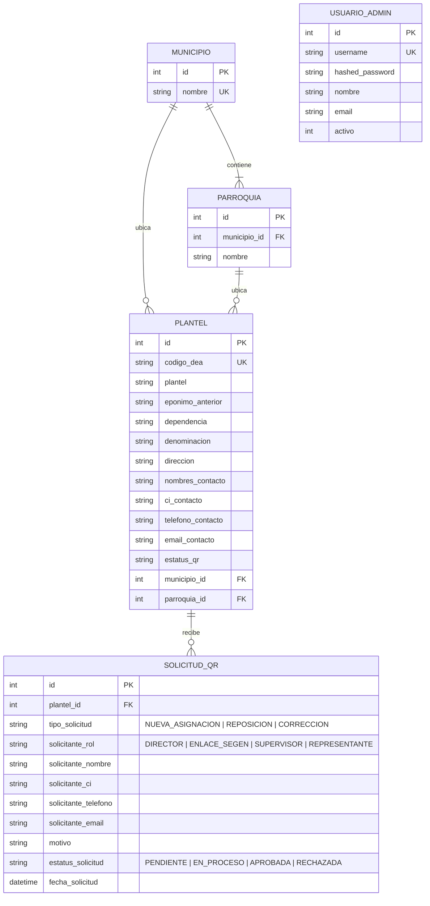
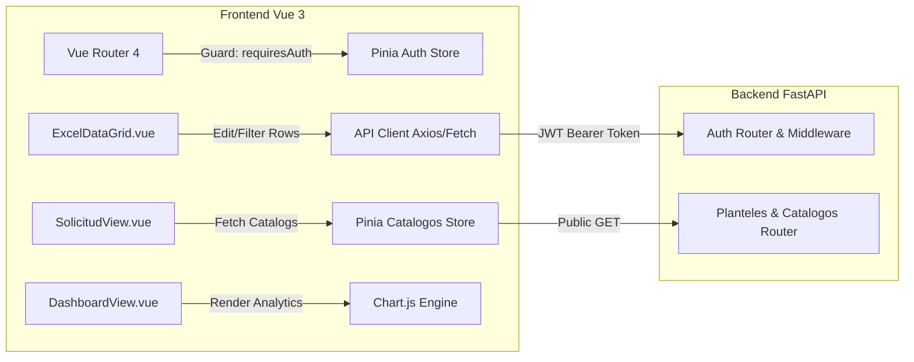

# 📐 Especificación Arquitectónica - Zona Educativa

Este documento describe la arquitectura técnica, las decisiones de diseño de software, el modelo de datos y los patrones de integración utilizados en el proyecto **Zona Educativa**.

---

## 1. Principios de Arquitectura

El sistema ha sido construido bajo los siguientes principios fundamentales:

- **Clean Layered Architecture**: Separación estricta entre capa de presentación (Router/Controlador), capa de lógica de negocio (Servicios/ETL), capa de persistencia (ORM/Modelos) y esquema de transmisión (DTOs/Schemas).
- **Asincronía & Alto Rendimiento**: Peticiones I/O no bloqueantes en FastAPI e iteraciones reactivas en Vue 3.
- **Resiliencia de Datos**: Manejo seguro de transacciones en base de datos mediante SQLAlchemy con sesiones scoped y rollback automático ante fallos.
- **Portabilidad y Aislamiento**: Ejecución homogénea mediante contenedores Docker para Backend, Frontend y Base de Datos.

---

## 2. Estructura del Proyecto

```text
zona_educativa/
├── docker-compose.yml           # Orquestación de servicios en Docker
├── .env.example                 # Plantilla de variables de entorno
├── PLANTELES EDUCATIVOS.xlsm    # Fuente de datos original para ETL
│
├── backend/                     # API REST FastAPI & Base de datos
│   ├── Dockerfile
│   ├── requirements.txt
│   └── app/
│       ├── main.py              # Definición de la aplicación y middlewares
│       ├── database.py          # Configuración del ORM SQLAlchemy
│       ├── models.py            # Modelos relacionales (Entities)
│       ├── schemas.py           # Esquemas Pydantic v2 (DTOs)
│       ├── excel_importer.py    # Servicio ETL de lectura y limpieza de Excel
│       ├── seed_data.py         # Ingesta inicial automatizada
│       ├── routers/             # Endpoints HTTP por dominio
│       │   ├── auth.py          # Autenticación JWT y Login Admin
│       │   ├── planteles.py     # Búsqueda y autocompletado de planteles
│       │   ├── solicitudes.py   # Creación y gestión de Solicitudes QR
│       │   ├── dashboard.py     # Agregaciones analíticas y KPIs
│       │   └── admin_data.py    # Operaciones del Data Grid
│       └── services/            # Tareas programadas y servicios auxiliares
│           └── cron_cleaner.py  # Background cleaner
│
└── frontend/                    # Single Page Application (SPA) Vue 3
    ├── Dockerfile
    ├── nginx.conf               # Configuración de Nginx Reverse Proxy
    ├── package.json
    └── src/
        ├── App.vue              # Componente raíz
        ├── main.js              # Inicialización de Vue, Pinia y Router
        ├── router/              # Configuración de rutas y Navigation Guards
        ├── stores/              # Tiendas de estado Pinia (catalogos.js, auth.js)
        ├── views/               # Vistas principales
        │   ├── SolicitudView.vue   # Formulario público de QR
        │   ├── LoginView.vue       # Acceso administrativo
        │   ├── DashboardView.vue   # Dashboard de KPIs con Chart.js
        │   └── ExcelDataGrid.vue   # Data Grid dinámico estilo Excel
        └── components/          # Componentes reutilizables UI
```

---

## 3. Modelo de Datos Relacional (Entidades)

El modelo relacional está optimizado para garantizar la integridad referencial y búsquedas de alta velocidad sobre municipios, parroquias y códigos DEA.



---

## 4. Flujo de Ingesta y Limpieza de Datos (ETL Engine)

El módulo `excel_importer.py` ejecuta el siguiente flujo de procesamiento al iniciar la aplicación:

1. **Extracción**: Lectura de las hojas del archivo `.xlsm` utilizando `pandas` y `openpyxl`.
2. **Transformación**:
   - Limpieza de cadenas de texto (eliminación de espacios sobrantes y caracteres especiales).
   - Normalización de nombres de Municipios y Parroquias para evitar inconsistencias tipográficas.
   - Parsing de coordenadas GPS (latitud, longitud, altitud) y campos telefónicos.
3. **Carga**:
   - Creación transaccional idempotente en PostgreSQL/SQLite.
   - Verificación de duplicados basados en `codigo_dea`.

---

## 5. Arquitectura del Frontend & Manejo de Estado



---

## 6. Decisiones de Seguridad

1. **Autenticación Basada en Tokens (JWT)**:
   - Contraseñas cifradas mediante `Passlib` con el algoritmo `bcrypt`.
   - Generación de JSON Web Tokens con expiración programada para sesiones administrativas.
2. **Protección de Enrutamiento en Frontend**:
   - `router.beforeEach`: Verifica la validez del token en `localStorage` antes de permitir la navegación a vistas `/admin/*`.
3. **CORS Configurado**:
   - Middleware restrictivo configurado en FastAPI para controlar orígenes permitidos en producción.
