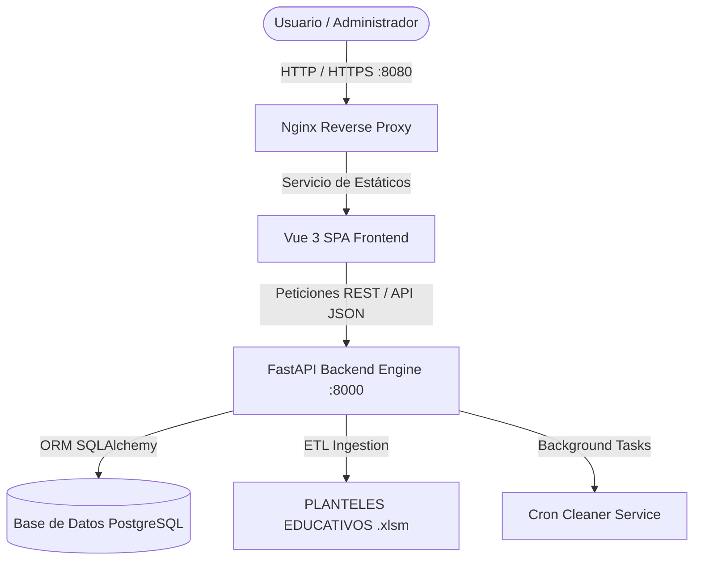

# 🏫 Zona Educativa - Sistema de Gestión de Solicitudes QR & Dashboard Analítico


> **Zona Educativa** es un sistema web de nivel empresarial diseñado para la ingesta masiva, gestión administrativa, tramitación de solicitudes de códigos QR y análisis en tiempo real de más de 980 planteles educativos.

---

## 📋 Tabla de Contenidos

- [📌 Vista General (Overview)](#-vista-general-overview)
- [✨ Características Clave](#-características-clave)
- [🎨 Sistema de Diseño: Nordic Clean & Sapphire Glass](#-sistema-de-diseño-nordic-clean--sapphire-glass)
- [🛠️ Stack Tecnológico](#️-stack-tecnológico)
- [🏗️ Arquitectura General](#️-arquitectura-general)
- [🚀 Instalación y Despliegue Rápido (Docker)](#-instalación-y-despliegue-rápido-docker)
- [📚 Documentación Adicional](#-documentación-adicional)
- [📄 Licencia](#-licencia)

---

## 📌 Vista General (Overview)

En el ámbito de la gestión pública educativa, descentralizar la información y mantener actualizados los registros de infraestructura y representación de casi mil planteles representa un desafío operativo crítico. 

**Zona Educativa** resuelve este problema mediante:
1. **Un Motor ETL Automatizado** que ingesta, limpia y valida datos relacionales complejos desde archivos Excel multihoja (`.xlsm`).
2. **Un Formulario Público Reactivo** donde directores, supervisores y enlaces institucionales tramitan solicitudes de emisión o reposición de códigos QR con autocompletado inteligente.
3. **Una Suite Administrativa Protegida** compuesta por un **Excel-like Data Grid** para edición masiva en tiempo real y un **Dashboard Analítico de KPIs** con gráficos interactivos.

---

## ✨ Características Clave

### 📊 Ingesta & Motor ETL de Datos
- **Procesamiento de Excel Multihoja**: Normalización automática de 988 planteles con asignación geográfica (Municipios y Parroquias).
- **Cero Pérdida de Datos**: Mapeo relacional resiliente mediante `SQLAlchemy` y `Pandas/OpenPyXL` que evita duplicados y limpia errores de codificación.

### 🌐 Formulario Público de Solicitudes QR
- **Búsqueda Reactiva**: Autocompletado inteligente por Código DEA, Nombre del Plantel, Municipio y Parroquia.
- **Validación Estricta**: Clasificación de tipos de solicitud (*Nueva Asignación*, *Reposición*, *Corrección*) y validación de roles solicitantes.

### ⚡ Data Grid Administrativo (Excel-like UI)
- **Filtros Combinados en Tiempo Real**: Filtrado multicriterio por Municipio, Dependencia, Nivel/Modalidad y Estatus de Levantamiento.
- **Paginación & Edición Rápida**: Interfaz dinámica construida en Vue 3 para gestionar grandes volúmenes de datos con latencia ultra baja.

### 📈 Dashboard Analítico de KPIs
- **Métricas Consolidadas**: Conteo total de planteles, tasa de atención de solicitudes y desglose por estado (*Pendiente*, *En Proceso*, *Aprobada*, *Rechazada*).
- **Visualización Interactiva**: Gráficos analíticos renderizados con `Chart.js` y `Vue-ChartJS` para la toma de decisiones estratégicas.

### 🛡️ Seguridad & Servicios Background
- **Autenticación JWT**: Protección de rutas administrativas mediante `OAuth2PasswordBearer` y `Vue Router Navigation Guards`.
- **Background Cron Cleaner**: Servicio programado para tareas periódicas de mantenimiento y verificación de integridad.

---

## 🎨 Sistema de Diseño: Nordic Clean & Sapphire Glass

El sistema cuenta con un lenguaje visual personalizado diseñado para ofrecer claridad técnica y elegancia ejecutiva:
- **Nordic Slate & Ice Blue Palette**: Tonos fríos y contrastes nítidos optimizados para reducir la fatiga visual en jornadas de administración prolongadas.
- **Sapphire Glassmorphism**: Tarjetas y modales con efectos de desenfoque de fondo (*backdrop blur*), bordes sutiles y sombras elevadas.
- **Micro-interacciones**: Transiciones fluidas en botones, entradas de texto y elementos de navegación.

---

## 🛠️ Stack Tecnológico

| Capa | Tecnologías |
| :--- | :--- |
| **Backend** | Python 3.11+, FastAPI, SQLAlchemy, Pydantic v2, Pandas, OpenPyXL, Passlib (Bcrypt), PyJWT |
| **Frontend** | Vue 3 (Composition API `<script setup>`), Pinia, Vue Router 4, TailwindCSS, Chart.js, Vite |
| **Bases de Datos** | PostgreSQL 16 (Producción / Docker), SQLite (Desarrollo Local) |
| **DevOps & Infra** | Docker, Docker Compose, Nginx (Reverse Proxy & Static Asset Serving) |

---

## 🏗️ Arquitectura General



---

## 🚀 Instalación y Despliegue Rápido (Docker)

### Prerrequisitos
- [Docker](https://www.docker.com/) (v20.10+)
- [Docker Compose](https://docs.docker.com/compose/) (v2.0+)
- Git

### Pasos:

1. **Clonar el repositorio:**
   ```bash
   git clone https://github.com/tu-usuario/zona_educativa.git
   cd zona_educativa
   ```

2. **Crear archivo de variables de entorno:**
   ```bash
   cp .env.example .env
   ```

3. **Desplegar contenedores:**
   ```bash
   docker-compose up -d --build
   ```

4. **Verificar estado de los contenedores:**
   ```bash
   docker-compose ps
   ```


## 📚 Documentación Adicional

- 📐 [Especificación Arquitectónica (`ARCHITECTURE.md`)](ARCHITECTURE.md) - Explicación detallada de capas, modelos de base de datos y diseño del frontend.
- 🐳 [Guía de Despliegue (`DEPLOYMENT.md`)](DEPLOYMENT.md) - Manual de producción con Docker, Nginx y variables de entorno.

---

## 📄 Licencia

Este proyecto está bajo la Licencia **MIT**. Consulta el archivo `LICENSE` para más detalles.
